# Substitution Grid Game (Substitution Skirmish!)

*An engaging and educational two player head-to-head maths game. Designed for middle school maths students learning the concepts of evaluating algebraic expressions and order of operations.*

[Play the game here](url) (Click the info button in the game header to find out instructions for how to play the game!)

## Table of Contents

1. UX

2. Features

3. Technology stack and dependencies

4. Deployment process

5. [Testing](./TESTING.md)

6. Evaluation of project

7. Acknowledgements and credits

## 1. UX

### 1.1 Project goals

**Player goals**

Audience: 

The primary target audience for players of this game is *10-15 year old children studying middle school level mathematics*. The secondary target audience is younger children for extension material or older children/adults for learning support material. 

Goals:

* Practice and test the mathematical concepts of substitution and order of operations.
* Practice and test the mathematical concepts of arithmetic operations, negative numbers and basic indices.
* Have fun testing their knowledge and competing against an opponent. 
* Improve confidence and fluency with numeracy and algebra skills.
* Have a positive and useful educational experience.

How project will satisfy these player goals:

* Game is designed to be adversarial to encourage focus and to motivate players - the game is head to head and is called 'Substitution Skirmish'. 
* Provides useful feedback to players about whether they have evaluated an expression correctly.
* Feedback is provided to players after each about whether they chose the optimal expression from the grid so that they can understand and improve their performance in the game over time.
* Complexity of algebric expressions is aligned with UK GCSE curriculum for expected level of proficiency of pupils aged 10-15 years.
* Mathematical notation used is clear, unambiguous and appropriate to experience of target audience players.
* Expressions vary each time the game is played to provide value to players for a longer period of time.
* UI of game board and controls is intuitive for new players to use.
* Styling and design is planned to be engaging and attractive to players of target audience.
* User feedback is clear, immediate and intuitive so players learn quickly how the game works.

**Teacher goals**

Audience:

The target audience for teachers using this game is *teachers/tutors of any school/national mathematics curriculum.*

Goals:

* To engage and motivate their students to practice and improve.
* Test students' knowledge and understanding by measuring their performance.
* Provide students with instant, automated feedback for their learning.
* To supply students with a less routine, more game based practice of mathematics. 
* To provide students with an activity that is educationally relevant and which has clear learning development value.
* An activity that facilitates differentiation for students of varying abilities in mathematics. 
* An activity that is easy to learn and undertstand how to engage with without much teacher instruction/intervention.

How project will satisfy these teacher goals:

* The game has a head-to-head competitive format to engage learners.
* Keeps track of performance of players in the game by measuring and informing when they chose the optimum expression.
* The visual design of the game is vibrant, fun, engaging and stimulating to learners with bold colors and simple user feedback.
* The game randomizes the selection of expressions so it is useful as a learning exercise multiple times and improvement can be seen over attempts made.
* There are difficulty options available to the user to provide a selection of more/less complex expressions to players of different ability levels. 
* The instructions and guidance for how to play the game is clearly displayed to the user and available at all times. 
* The user is clearly and gracefully informed if they perform an incorrect or disallowed action or input.

**Developer and site owner goals**

* As a secondary maths teacher - to create a useful and engaging learning activity to help mathematics students in my classes and in my school community. 
* To practice and deepen my understanding of how to use JavaScript, HTML and CSS by creating an interactive, user-friendly web appliations.
* To begin the journey of creating interactive educational applications as I seek to change to a career in this sector. 
* To create a project that can be part of an interesting and commercially viable developer porfolio to help me find a job.
* To learn more about and practice the paradigm of test-driven development (TDD) with JavaScript and the Jasmine test suite. 
* To improve my ability to design and create useful educational experiences with technology through the process of planning, implementing and testing this application and crucially, obtaining feedback from other teaching proffessionals. 

### 1.2 User Stories

As a player...

1. I want to easily understand the aim of the game, so that I can think about how to leverage and employ my mathematical knowledge.
2. I want to easily find and understand the controls of the game and how to interact with them, so that I can engage and play effectively and implement my strategies
3. I want clear user feedback from my interaction with the game, so that I know whether I have completed an interaction correctly.
4. I want mathematical questions, notation and content that is relevant to my level of knowledge and understanding, so that I can succeed at the aims of the game, learn from feedback and have fun playing the game.
5. I want to see my score and my opponent's game score easily and clearly, so I can know if I am winning the game or not!
6. I want to test my mathematical understanding and fluency, so that I can understand and try to correct any misconceptions I am retaining.
7. I want feedback on my relative performance in the game during play and over multiple plays, so that I can measure and set targets for my improvement.
8. I want to be able to choose between levels of difficulty for the game, so that I can play at the level appropriate for me and I can continue to stay engaged and challenged as I improve. 

As a teacher...

1. I want the game to be easy to understand and interact with for players, so that it requires minimal explanation from me and I can focus on correcting my pupils' understanding of the mathematical concepts. 
2. I want the user interface, player scores and player performance to be easily visible on the screen, so that I can evaluate students understanding and intervene where necessary.
3. I want the game to be fun and engaging, so that players are motivated to try their best and want to understand the concepts better so they can perform better in the game.
4. I want the mathematical concepts and difficulty to be relevant to the ability and curriculum of the players, so that I know I am providing them with a useful and relevant learning experience. 
5. I want the game to offer differentiated levels of difficulty, so that I can challenge and support players of varying ability levels.
6. I want the game to provide feedback to players automatically and instantly, so that they can learn effectively independently and know when to ask for my input. 
7. I want the styling, aesthetic design and effects of the application to be appropriate for the age of my students and gender neutral in tone, so that it is a visually stimulating experience for as many players as possible.
8. I want the application to keep track of player scores and performance automatically, so that they are motivated and engaged by competition and I can view their performance easily.

### 1.3 Wireframes and design choices

* Wireframes were created using [Balsamiq](https://balsamiq.com/):

[Link to wireframes pdf](./images/maths-substitution-game-wireframes.pdf)

**Design choices**

Information architecture

* Modals instead of separate pages were used for welcome and game over user sub-interfaces to avoid page reload and provide a soother more coherent UX.
* Welcome modal displayed when url is first requested. Button to close modal and show main gameboard only. 
* Game over modal displayed at end of game. Button to close modal to main gamebaord only or close modal and open welcome modal.

Colors:

* A colorful, vibrant color palette was selected using the 'trending' feature from [coolors.co](https://coolors.co/palettes/trending). The contrast in the palette makes the game board and interactive elements easy to see and navigate for younger users. The bright colors and contrast are used to aid the experience of user interaction by making it easier to understand how to play the game and see feedback.
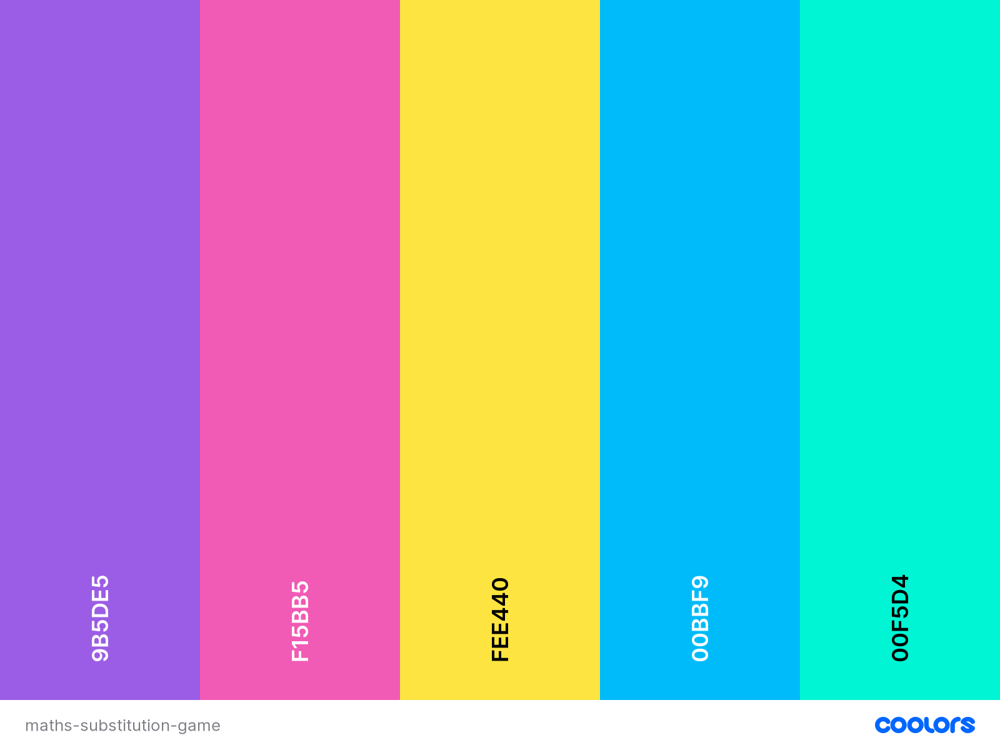
* Strong and striking color contrasts were chosen for various togglable display/hide elements of the page to guide users' attention on a busy user interface.

Fonts:

* Selected and downloaded from [fontspace](url). Both fonts under a 'free' liscence. 
* [Arbei Berry](https://www.fontspace.com/a-arbei-berry-font-f45335) font was chosen as a title font for it's bold, clear glyphs and a fun, playful feel.
* [Really Free](https://www.fontspace.com/really-font-f45186) font was chosen as a body text/aside font for it's contrast with Arbei Berry and it's attractive, fun, freeflowing qualities.
* These fonts were chosen to emphasize fun and to be engaging for children. The core purpose of the game is learning maths which is daunting and somethimes dry to children so it was important for the aesthetic to be accessible and feel unthreatening and light-hearted. 

User feedback:

* Clear and immediate feedback provided by snappy animations and transitions during gameplay to make experience more satisfying and enjoyable for players who are interacting under time pressure. 

Layout:

* I decided against using the Bootstrap framework because I wanted finer control over responsive layout by using specific breakpoints for media queries. Also I felt a Grid layout was very appropriate to this project and I wanted practice using the CSS Grid and CSS Flexbox systems directly, even if this was more time consuming. 
* The gameboard is much taller and narrower on mobile viewport so player scores and 'click to play' elements are always visible fixed to top of viewport when scrolling down page.
* 767px chosen for 'tablet' breakpoint as it is just below popular tablet device size of 768px and ensures tablet layout is displayed on most popular tablet devices. Dev tools used during implementation to confirm this viewport width is large enough to accommodate 4 columns on gameboard section
* 1023px chosen for 'desktop' breakpoint as it is just below desktop popular device size of 1024px. Dev tools used during implementation to confirm this viewport width is large enough to accommodate horizontally adjacent gameboard and click to play / info components. 
* A desktop first approach was considered as the main use of the application will be in classrooms where users will have larger screen sizes. However, in order to ensure the application is accessible and performant for all users on mobile (and those outside a classroom environment), a mobile first approach was chosen with an aim to optimize the experience for tablet/desktop screen sizes as much as possible.

**Deviations from wireframes and original plan made during implementation**

* 'Click to Play' section: player name removed and 'click to play' instruction displayed above '?' icon
* 'Click to Play' section moved to left of scoreboard section on mobile view for consistent positioning of key interactive component of application across viewport sizes
* Footer mobile viewport wireframe layout replicated on tablet and desktop viewports because it looks good and because footer display is toggle on/off there is no need to conserve vertical space
* Layout on desktop viewport changed significantly: header made consistent with mobile and tablet viewports so that info icon remains at top right of viewport. Scoreboard is displayed on left of gameboard below 'click-to-play' component. 
* Info component on welcome modal changed to be togglable icon adjacent to header (consistent with header layout on main page for mobile/tablet viewports) instead of being separate below header
* Welcome modal layout made consistent on all viewport sizes. Max width set for larger viewports to maintain the vertical mobile layout.
* Content of modal made scrollable once height is larger than container.
* Once a question is selected and a user makes an answer attempt, the question is removed from the board (disabled) and cannot be selected again by either player (this avoids players copy each other's choices!)
* Time bonus component not implemented for scoreboard. The bonus score element remove from HTML and now player score depends only on the ranking of the question selected. 
* Countdown timer not implemented (not essential to game)
* Reduced number of player turns to 5 to avoid more trivial selections at end of game
* Changed layout and content of gameover modal to display the winner's name in large and both players name's and scores below in smaller ovals - this layout also works for a tied game result.
* Added labels to player score and player turn components on scoreboard

## 2. Features

### 2.1 Existing features

1. Welcome modal

* On first loading the page, the welcome modal is displayed for players to input names and select a difficulty level (easier or harder).
* The modal can only be closed by entering valid player names and selecting a difficulty level then clicking 'start game' button.
* The start game button exhibits a grow animation on hover and a press down animation when clicked by the user. 
* The modal displays an error message if start game is clicked when a player name is left blank or is longer than 10 characters or a difficulty level is not selected. 
* Info button at top right of page can be cliked to hide welcome modal content and display instructions for game. CLick again to unhide welcoem modal contents and hide instructions. 
* About button can be clicked to unhide footer content (with two external links to projects and developer information) and the page scrolls down so that entire footer content is in view. Clicking the about button again will rehide the footer content. 

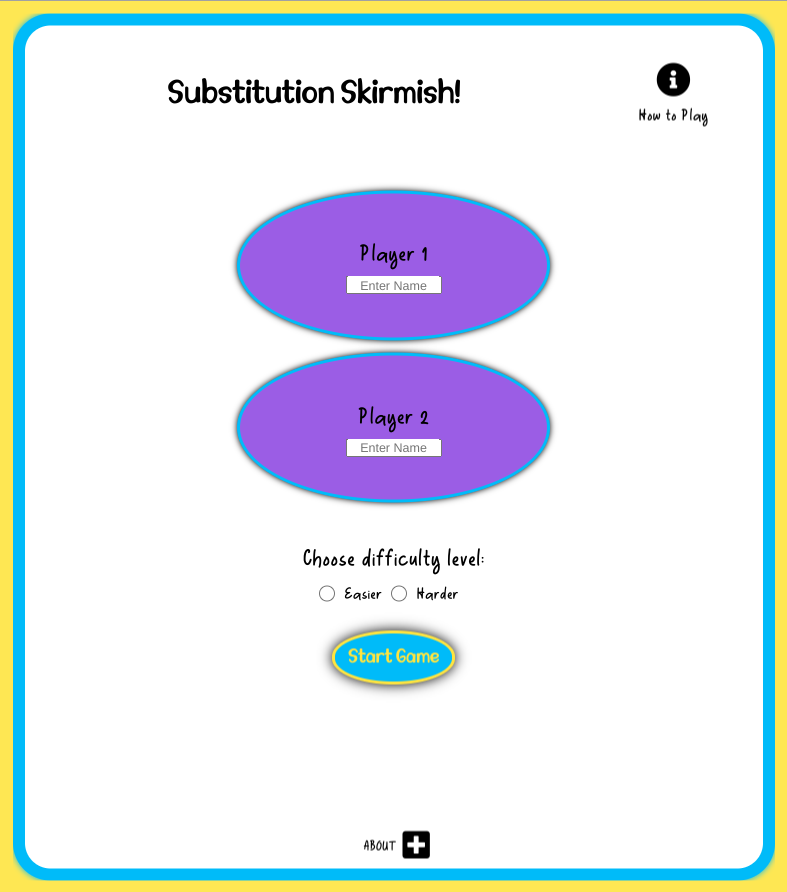
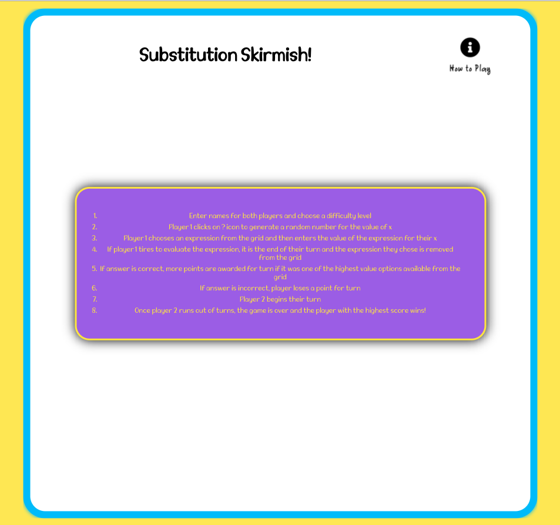

**Note the info button, instructions popover and the footer about button and footer contents form and functionality are replicated on the main gamebaord view after the welcome modal is closed"

2. Click to play element

* When welcome modal is closed, at the start of game, displays value player 1 name from welcome modal input, pulsing '?' icon and the text 'click to play'. The cursor is a pointer when ? icon is hovered over. 
* When clicked/pressed the ? icon disappears and is replaced by a changing (pulsing) random number (in a range determined by the difficulty level selected) then after a few seconds a single number is displayed (not pulsing) and the text beneath changes to 'choose an expression'.
* After a player has submited an answer in the gameboard element and a delay for feedback on answer has passed (described below) this element displays with player 2 name above pulsing '?' icon and 'click to play' text

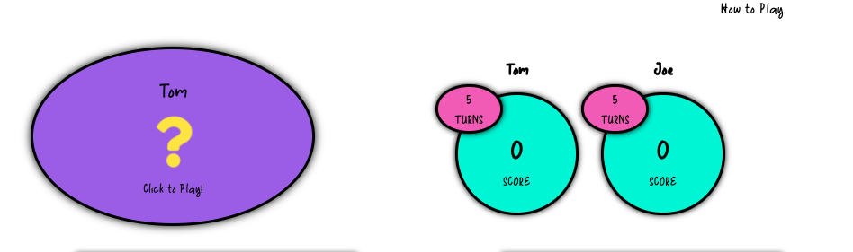
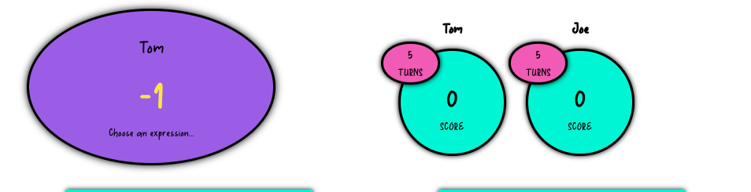
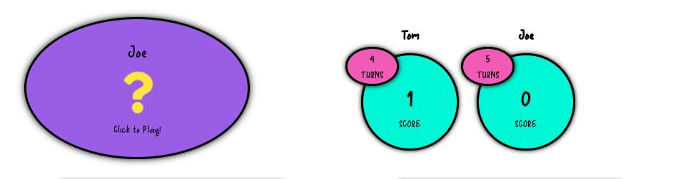

3. Scoreboard

* When welcome modal is closed, at the start of game, displays value of player 1 name above left sub scoreboard and value of player 2 name above right sub scoreboard. Both sub scoreboards display "turns 5" and "score 0" initially. 
* After a player submits an answer to the gameboard element and a delay for feedback on answer has passed (described below), this element displays a turns vlaue decreased by one and a score value increased by the score calculated (and displayed in gamebaord overlay feedback - described below) for the respective player's scorebaord.

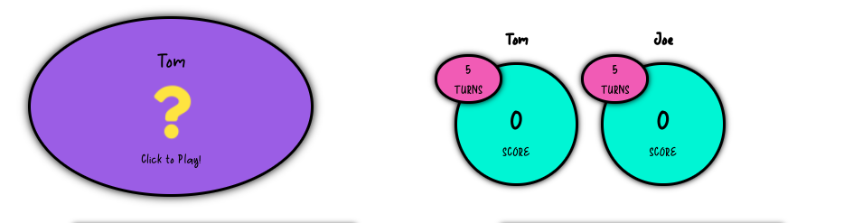
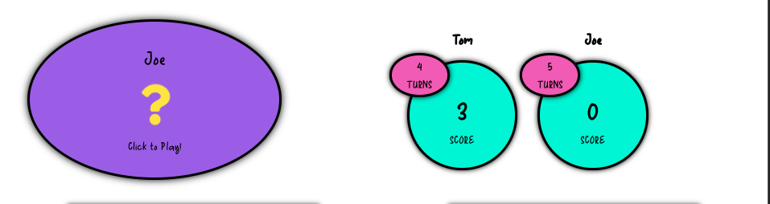
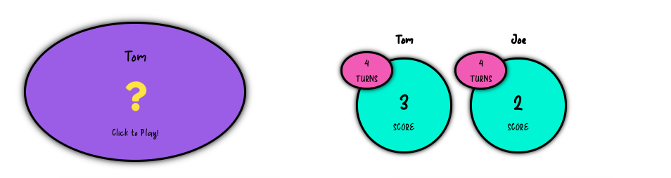

4. Gameboard grid

* When welcome modal is closed, at the start of game, grid displays 16 latex rendered mathematical expressions in a grid layout each with a yellow background color. 
* The grid layout is 8x2 on mobile and 4x4 on tablet. The position of the grid is below the click to play and scorebaord on mobile and tablet and to the right of these elements on desktop. 
* The complexity of the mathematical expressions is higher if the harder difficulty is selcted in welcome modal and less complex if easier is selected. 
* Each time the game is loaded (or if restart button is clicked from gameover modal - described below), the nathematical expressions shown are different in order and in the value of the cooeficients (number in front of the variable in each term)
* At the start of a game, the grid cannot be interacted with until player 1 clicks the ? icon in the click to play component and the text in this element changes to "choose an expression". Then any grid item can be clicked and the user will see the grid hidden by an overlay with the chosen mathemtical expression shown (rendered in latex), text staying "evaluate when x=a" (where a s the number currently displayed in the click to play element), an input box and two buttons: 'enter' and 'choose again'
* Both buttons exhibit a hover grow effect and a 'press in' active effect. 
* If a user enters an invalid answer (not a valid numerical format) an error message displays below input: 'enter a valid value'
* If the user selects 'choose again' the overlay hides and the full gameboard is displayed again. Any other grid item can be selected and the user will see the overlay again with the latex content replaced by the expression in the chosen grid item. 
* If the user enters a correct answer for the displayed expression with the current variable value: the user sees a green background with a tick icon in the overlay informing them that their answer was correct, the ranking of the value of their chosen expression from the available expressions on the grid and a score for their turn corresponding to this ranking. 
* If the user enters a incorrect answer for the displayed expression with the current variable value: the user sees a red background with a cross icon in the overlay informing them that their answer was incorrect, and telling them the correct answer, the ranking of the value of their chosen expression from the available expressions on the grid and a score for -1 for submitting a wrong answer. 
* After a user submits a valid (correct or incorrect) answer, the overlay displays the feedback for 5 seconds then the gamebaord grid is visible again. The scoreboard and click to play element contents are updated (see description above). The grid expression that was evaluated now has a background of grey color. After the next player (player 2) clicks the ? icon, all of the grid items will be clickable to launch the overlay except the one chosen that will remain inactive and gray for the rest of the game. After this turn, the expession chosen and answered will also become gray and inactive.

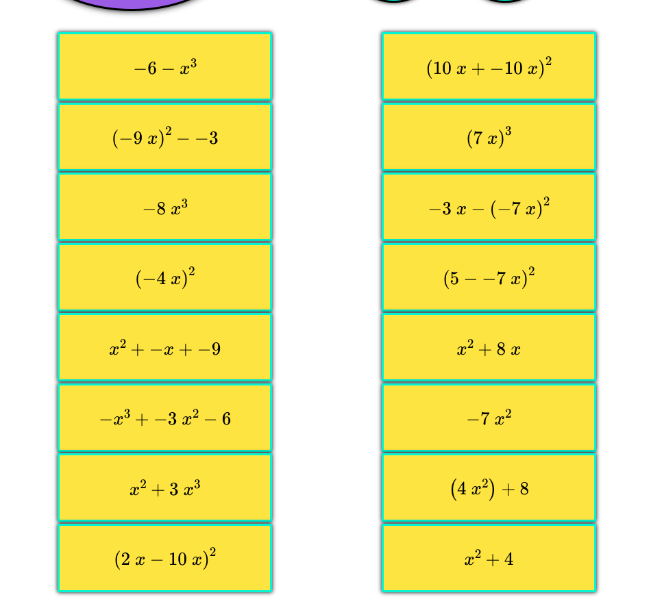
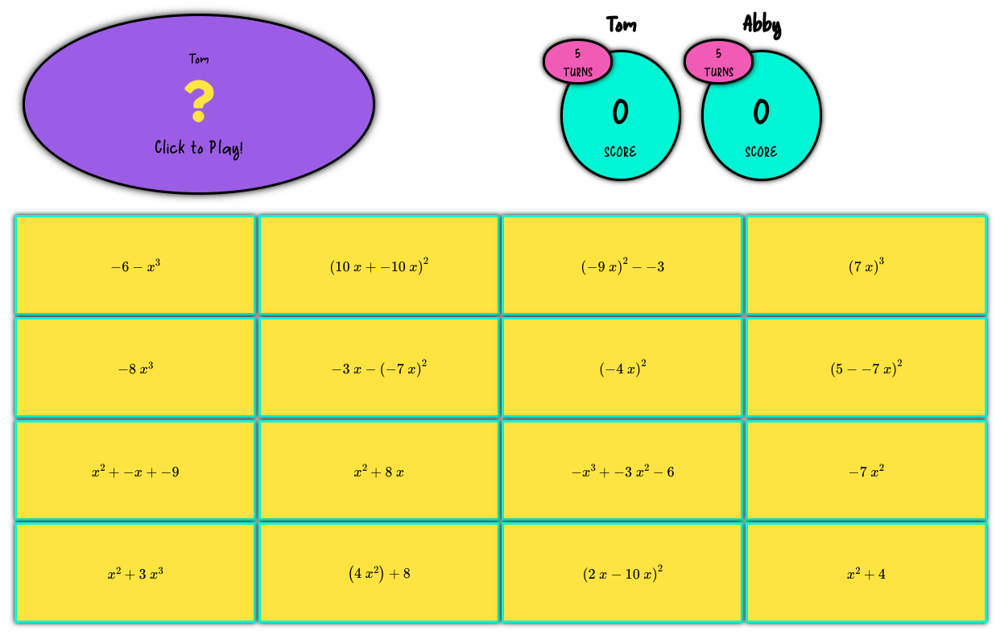
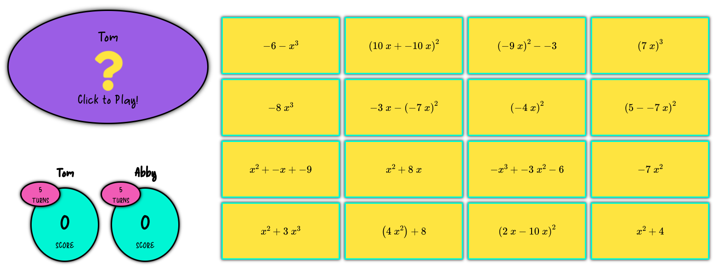
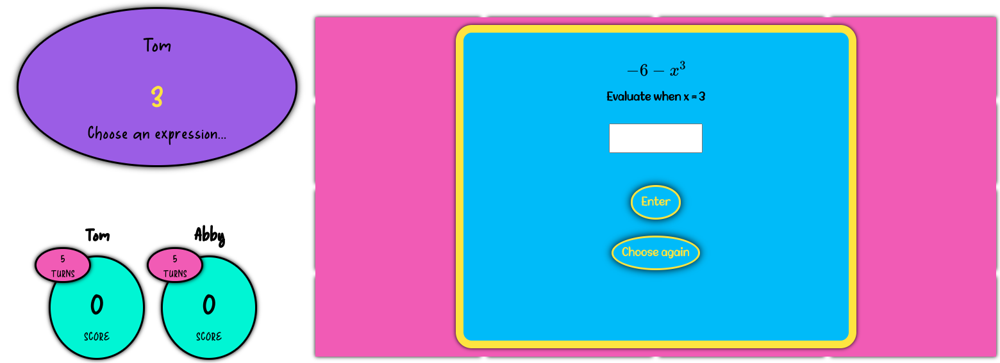
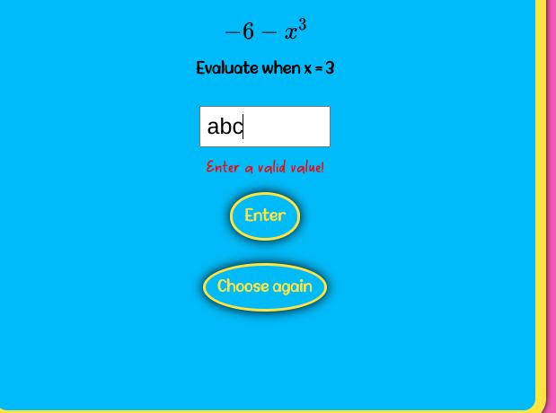
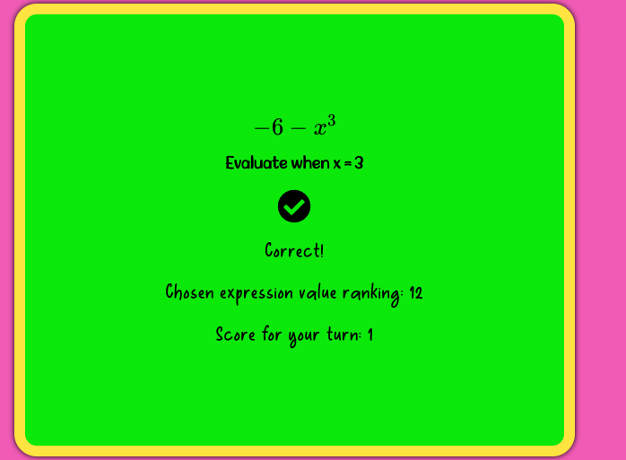
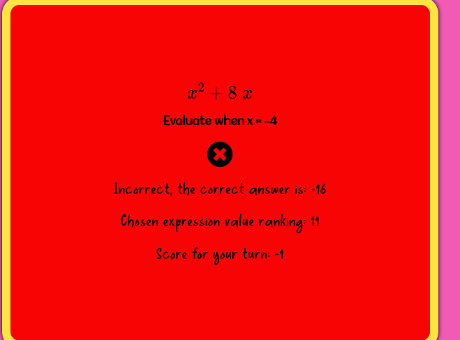
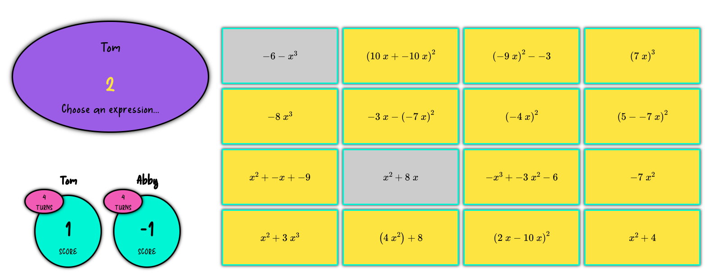

5. Game over modal

* When player 2 turns decreases to 0, game ends and gameovermodal unhides on top of main gamebaord view. 
* The name of the winning player is displayed below the header (or a draw is announced if both players finish with the same score)
* The player 1 and player 2 final scores are displayed beneath below respective player names. 
* Two buttons are displayed 'restart' and 'new game'. Both button exhibit grow effect on hover and press down effect when active. 
* If restart is clicked, the gameover modal hides and the main gameboard is displayed in initial state (described above) with same player names and with a new set of expressions from previous game 
* If new game is clicked, the url of the page reloads in the broswer and the welcome modal is displayed in it's initial state (described above).
* The info button and the about footer button are not displayed in the gameover modal. 

### 2.2 Features left to implement

* Add sound effects triggered by user interactions with game
* Add media query styling specifically for print view so teachers can print activity for use in lessons
* Add restart game button to main page
* Improve expression generation and evaluation to include expressions involving fractions
* Add animation effects to displaying/hiding of elements on page to improve user experience
* Add a countdown timer to the click to play component that runs once a player clicks ? and implement time bonus component (calculated from countdown timer value at end of turn) to scoreboard which rewards players for answering quickly
* Add feature to welcome modal which allows user to select amount of time allowed per question
* Create a log of player responses and include option to email to teacher on 'game over' modal
* Add option to share scores on facebook/twitter link on game over page
* Store top scores for each player in local storage so when restart game is clicked, player performance can be measured across multiple games. 
* Add click event listener to body so that user can bring manually invoke the start of next turn once they have read feedback from gameboard overlay.
* Add hover/active effects to gameboard grid
* Info text changes when instructions content is visible to be 'back to game'
* Footer icon changes to a '-' symbol when footer content is visible
* After user answers a question, the grid could be displayed with the expressions reordered in descending value so user can better understand how to improve at the game

## 3.Technology Stack and Dependencies

* [cdnjs](https://cdnjs.com/libraries/jasmine) content distribution network used for Jasmine framework and mathjs library.
* [jsdelivr](https://www.jsdelivr.com/package/npm/jasmine-jquery) content distribution network for Jasmine-jQuery files and mathJax library.
* [SASS](https://sass-lang.com/) CSS pre-processor used to effectively modularize styles and for practice as this is the first time I have used SASS.
* [jQuery](https://jquery.com/) used for DOM manipulation and DOM representation with Jasmine specs (slim build delivered).
* [Jasmine]
* [jasmine-jquery]
* [mathjs library](https://mathjs.org/index.html) linked from cdnjs and used to evaluate function expressions for Gameboard object
* [mathJax library]() linked from jsdelivr cdn and used for rendering mathematical expressions in browser
* [Autoprefixer CSS](https://autoprefixer.github.io/) for back compatibility with older browsers
* [W3C CSS Jigsaw Validator](https://jigsaw.w3.org/css-validator/validator) to validate style.css 
* [W3C Markup validatior](https://validator.w3.org/) to validate HTML

## 4. Deployment Proceedure

### 4.1 Deployment process followed by developer to hosting platform

This project was developed using [Gitpod](https://gitpod.io/) cloud IDE, committed to gitpod workspace with git and then push remotely to the Github repository for the project.

To deploy this application from it's remote Github repository, the following process was followed:

1. Login to Github as [thaysom22](https://github.com/thaysom22)
2. Go to the [Github repository page](https://github.com/thaysom22/maths-substitution-game) for this application
3. Select settings from the menu and scroll to Github pages section.
4. Select 'master' branch for source and '/root' for folder.
5. Click 'save' and the page will refresh as the site is being built and deployed.
6. After a short wait the [url for the live site](https://thaysom22.github.io/maths-substitution-game/) is available in the Github pages section of the settings page. 

### 4.2 How to clone and run this project locally

To clone this project locally from Github:

1. Login to Github as [thaysom22](https://github.com/thaysom22)
2. Go to the [Github repository page](https://github.com/thaysom22/maths-substitution-game) for this application
3. Click the 'code' dropdown menu option near the top of the screen.
4. Select the HTTPS option and copy the URL for the repository.
5. Open local or cloud IDE with git installed (or built in) e.g gitpod and change current working directory to where clone is to be made. 
6. Type git clone URL (where URL is the URL copied above) and press enter. Local clone of project will be created.

## 5. Testing

* Found in separate [TESTING.md](./TESTING.md) file.

## 6. Evaluation of project as a learning exercise

* Need to use custom jQuery Jasmine matchers when selecting with jQuery **because a jQuery object wrapping DOM references is returned.**
* In future projects I would like to use specific "js-*" classes or "data-*" attributes for selection by Javascript; however since this project is relatively small scale and I was already quite far through the project when I realized this I decided it was not enough of a priority to be worthwhile refactoring HTML, JS and fixture strings.
* The mathjs library is amazing! I can use this to help me create more educational tools and games in the future. I tried to use the api for this project (and I wrote function to send XML Request) as I wanted to practice using the XMLHttpRequest object and working with JSON data. However, the REST API is served only over http:// and not https:// so I was getting Mixed Content Error as site is hosted using https://. Thereefore I used the library instead linked in HTML source from CDN.
* Try to use variables for reused values like delay for setTimeout calls so that these can be updated throughout codebase simultaneously. Having them hardcoded means that all must be found and changed and leaving one can break the application or compromise the intended user experience. 
* Using mixins in scss was very useful to avoid repetitive codebase and save time!
* Next project set up npm install sass and saas --watch commands to run at initialization of workspace and each time workspace is opened respectively. 
* Would like to try incorportating use of window.localStorage and window.sessionStorage APIs (proabably to store user high scores across multiple game instances )
* Use npm package for css post-processing (auto prefixing for older broswer compatibility)
* I need more practice with unit testing. Writing meaningful and effective tests BEFORE writing code to try to pass those tests (a TDD workflow). I found during this project that trying to write tests before coding and having a clear idea of what the architecture and implemenation details of my program would be, was very difficult and time consuming. I ended up writing most tests POST implementation which was helpful to review my implementation choices - refactor if necessary - and to learn about unit test syntax, but I did not feel that this became integrated into my workflow and an effective tool to improve my code quality. 
* When post-processing .css file after it has been compiled from scss, any changes are lost if changes to scss need to be made and css is recompiled. Is there a way to keep post-processing / post-editing when re-compiling?

## 7. Acknowledgements and Credits

### 7.1 Credits

**Content**

* [Font Awesome](url) used for font icons and docs for accessibility best practice info.

**Media**

**Code**

* [WebDevSimplifed YouTube channel](https://www.youtube.com/channel/UCFbNIlppjAuEX4znoulh0Cw) for idea for using global reset styles
* [mathjs docs](https://mathjs.org/docs/index.html) for using API for math.js library
* [Stack Overflow](https://stackoverflow.com/questions/36489579/this-within-es6-class-method) for .bind() used thoughout JavaScript to preserve this in context 
* [hover.css](https://ianlunn.github.io/Hover/) used for animation effects on interactive elements of application

### 7.2 Acknowledgements

* [itnext.io article](https://itnext.io/structuring-your-sass-projects-c8d41fa55ed4) about directory structure for SCSS files
* [hobo-web article](https://www.hobo-web.co.uk/best-screen-size/) about choosing breakpoints for responsive design
* [Bootstrap GitHub repository](https://github.com/twbs/bootstrap) for CSS and JavaScript used to help create welcome and game-over modals.

### 7.3 Disclaimer

The content of this website is for educational purposes of developer only. The project was created for the assessment requirements of the 'Code Institute Full Stack Diploma in Software Development' and the developer has no commercial purposes for this project.